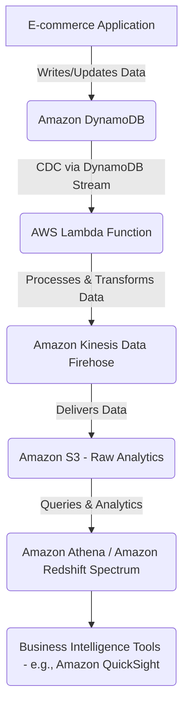

### **Concept Title: Real-time Analytics with Amazon DynamoDB Streams and AWS Lambda 🚀**

-----

### **Problem Statement & Business Use Cases**

Imagine an e-commerce platform with millions of users. They want to understand user behavior in real-time, such as popular product views, abandoned carts, or sudden spikes in purchases, to personalize experiences, optimize inventory, and detect anomalies instantly. Traditional batch processing for analytics would introduce significant delays, making it impossible to react to these events immediately.

**Business Use Cases:**

  * **Personalized Recommendations:** Instantly update product recommendations based on a user's latest viewed items.
  * **Fraud Detection:** Detect suspicious transaction patterns as they occur.
  * **Real-time Dashboards:** Provide up-to-the-minute insights into website traffic, sales, and user engagement.
  * **Inventory Management:** Adjust stock levels dynamically based on real-time sales data.

-----

### **Core Principles**

This solution leverages the power of **event-driven architecture** and **serverless computing**.

  * **Change Data Capture (CDC):** DynamoDB Streams capture every item-level modification (insert, update, delete) in a DynamoDB table in near real-time.
  * **Event-Driven Processing:** AWS Lambda functions are triggered automatically by these stream events, allowing for immediate processing of the changes.
  * **Serverless:** Both DynamoDB and Lambda are serverless services, meaning you don't provision or manage servers, scaling automatically to handle varying loads.

-----

### **Pre-Requirements**

Here are the AWS services and tools we'll use:

  * **Amazon DynamoDB** (🛠️): Our NoSQL database for storing application data. We'll enable DynamoDB Streams on the table to capture changes.
  * **AWS Lambda** (🛠️): A serverless compute service that will process the events from DynamoDB Streams.
  * **Amazon Kinesis Data Firehose** (🛠️) (Optional but recommended for analytics): A fully managed service for delivering real-time streaming data to destinations like Amazon S3, Amazon Redshift, or Splunk.
  * **Amazon S3** (🛠️): Object storage for storing raw or processed analytical data.
  * **AWS Identity and Access Management (IAM)** (🛠️): For managing permissions for Lambda to access DynamoDB Streams and Kinesis Data Firehose/S3.

-----

### **Implementation Steps**

Let's walk through the steps to set up real-time analytics.

1.  **Create a DynamoDB Table with Streams Enabled:**

      * Go to the DynamoDB console.
      * Create a new table (e.g., `ecommerce_events`).
      * Define a primary key (e.g., `event_id`).
      * Crucially, enable **DynamoDB Streams** for this table, selecting "New and old images" to capture all data changes.

2.  **Create an AWS Lambda Function:**

      * Go to the Lambda console.
      * Create a new function from scratch.
      * Choose a runtime (e.g., Node.js or Python).
      * Set up an execution role with permissions to read from DynamoDB Streams and write to Kinesis Data Firehose/S3.
      * Write your Lambda function code to process the DynamoDB stream records. For example, parse the `eventName` (INSERT, MODIFY, REMOVE) and the `NewImage` or `OldImage` data.
      * Inside the Lambda, format the data as needed and send it to your chosen analytics destination (e.g., Kinesis Data Firehose for delivery to S3).

    <!-- end list -->

    ```javascript
    // Example Node.js Lambda code
    exports.handler = async (event) => {
        for (const record of event.Records) {
            console.log('Stream record:', JSON.stringify(record, null, 2));

            if (record.eventName === 'INSERT' || record.eventName === 'MODIFY') {
                const newImage = record.dynamodb.NewImage;
                const eventData = {
                    eventType: record.eventName,
                    itemId: newImage.itemId?.S, // Assuming itemId is a string
                    timestamp: newImage.timestamp?.S,
                    // ... other attributes you want to capture
                };
                // Send eventData to Kinesis Data Firehose
                // You'll need to use the AWS SDK for Kinesis Data Firehose putRecordBatch
                console.log('Processed Event:', eventData);
                // Example: await kinesisFirehose.putRecordBatch(...)
            }
        }
        return `Successfully processed ${event.Records.length} records.`;
    };
    ```

3.  **Configure DynamoDB Stream as Lambda Trigger:**

      * In the Lambda function's designer, add a trigger.
      * Select "DynamoDB" as the trigger type.
      * Choose the `ecommerce_events` table.
      * Set the **Batch size** (e.g., 100) and **Starting position** (e.g., "Trim Horizon" for all new events).

4.  **Set up Kinesis Data Firehose (Optional but Recommended):**

      * Go to the Kinesis console and create a new Delivery Stream.
      * Choose "Direct PUT" if your Lambda directly sends data, or "DynamoDB stream" if you want Firehose to consume the stream directly (though Lambda gives more processing flexibility).
      * Select your destination (e.g., Amazon S3). Configure an S3 bucket for storing your raw analytics data.
      * You can also enable data transformation and conversion within Firehose.

-----

### **Data Flow Diagram**



-----

### **Security Measures**

  * **IAM Roles and Least Privilege:** Grant Lambda only the necessary permissions to read from DynamoDB Streams and write to Kinesis/S3. Avoid overly broad permissions.
  * **VPC Endpoint for DynamoDB:** If your Lambda functions are in a VPC, use VPC endpoints for DynamoDB and S3 to ensure traffic stays within the AWS network.
  * **Encryption:** DynamoDB encrypts data at rest by default. Ensure S3 buckets are also configured with default encryption.
  * **Lambda Environment Variables:** Use Lambda environment variables for sensitive configurations, but avoid storing secrets directly. Use AWS Secrets Manager for sensitive credentials.
  * **CloudWatch Logs:** Monitor Lambda execution and DynamoDB Stream activities using Amazon CloudWatch logs for auditing and anomaly detection.

-----

### **Benefits**

  * **Real-time Insights:** Enables immediate reactions to business events.
  * **Scalability:** DynamoDB and Lambda automatically scale to handle high data volumes and processing loads.
  * **Cost-Effectiveness:** Pay-as-you-go model for both services, eliminating the need for upfront infrastructure investments.
  * **Reduced Operational Overhead:** Serverless nature means no server management or patching.
  * **Improved User Experience:** Personalization and dynamic responses lead to better engagement.

-----

### **Performance Measure**

  * **Batch Size and Window for Lambda:** Tune the Lambda batch size and batch window for DynamoDB stream triggers. A larger batch size can reduce invocations but increase latency; a smaller one increases invocations but reduces latency.
  * **Lambda Memory and Concurrency:** Optimize Lambda function memory and concurrency settings based on the processing complexity and expected throughput.
  * **Provisioned Throughput (DynamoDB):** Monitor DynamoDB consumed read/write capacity units and adjust provisioned throughput or use on-demand capacity to prevent throttling.
  * **Kinesis Data Firehose Buffering Hints:** Configure buffering hints (buffer size and buffer interval) in Kinesis Data Firehose to optimize delivery to S3 or other destinations.
  * **Idempotency in Lambda:** Design your Lambda function to be idempotent, especially when processing stream records, to handle potential retries gracefully and prevent duplicate processing.

-----

### **Summary**

Leveraging **Amazon DynamoDB Streams** with **AWS Lambda** provides a powerful, scalable, and cost-effective architecture for building **real-time analytics** solutions. This event-driven approach allows businesses to gain immediate insights from their data, enabling agile responses to changing conditions and enhancing user experiences. By carefully configuring the services and adhering to security and performance best practices, you can unlock the full potential of your operational data.